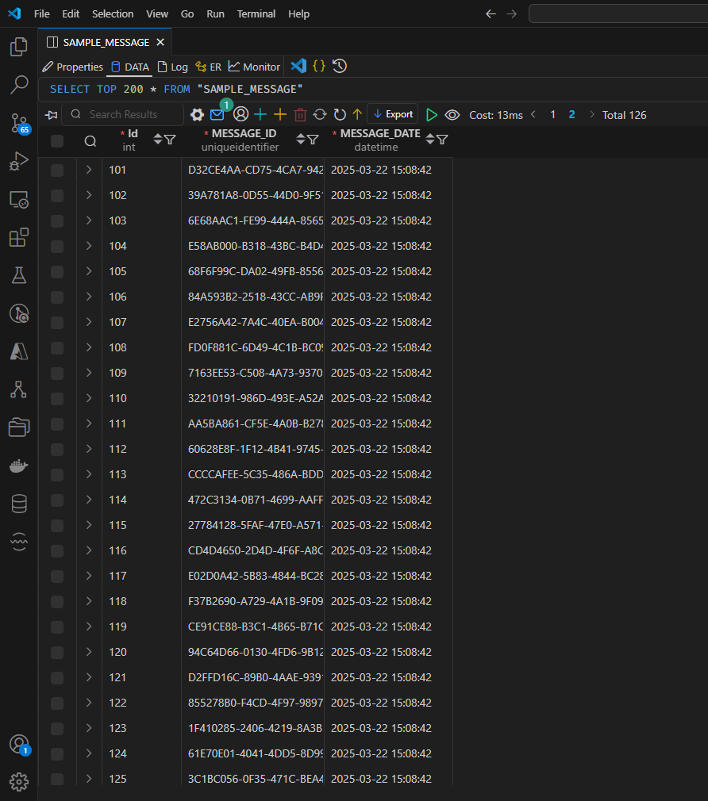
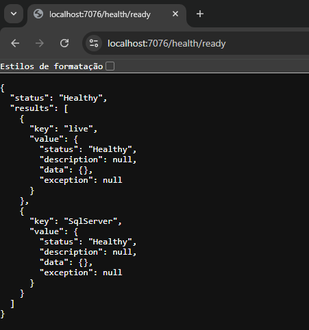
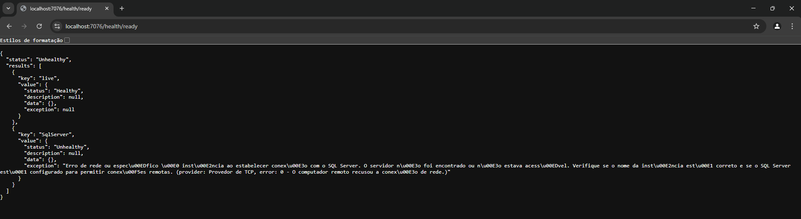

# Kafka Poc

Pub/Sub Kafka - POC Multiple Consumers

I wrote a [Medium](https://medium.com/p/659362b4fe0d#8077-e1407e7d701e) post here explaining the purpose of this project.

"Scaling Data Processing with .NET, Kafka, and Parallel Consumers"

Additionaly here I'll explain how to run the project locally and some known issues.

## Description

This project is a POC to demonstrate how to use Kafka as a Pub/Sub system with multiple consumers.

## How to run

Using visual studio run the API + Worker profile and it will start both projects.

Run the docker-compose file to start the Kafka and Zookeeper containers.

```bash
docker-compose up
```

## Database

The docker compose will create a SQL Server and a database, when the POST /api/v1/kafka endpoint is called, it will insert some data into SAMPLE_MESSAGES table.



## Healthcheck

You can also check if the docker containers are running properly by accessing the healthcheck endpoint "/health/ready".

### Healthy



### Unhealthy

If something goes wrong, you will se an error message like this one, and it will guide you trough the problem.



## Knwown Issues

If you have any trouble running locally, I suggest these handful docker commands:

Remove all containers:
docker rm -vf $(docker ps -a -q)

Remove all Volumes:
docker volume rm $(docker volume ls -q)

Not necessary, but if you want to remove all images:
docker rmi -f $(docker images -a -q)

If the database doesn't proper initialize, try increasing the 60 seconds in the docker-compose file here:

```yaml
command: /bin/bash -c "sleep 60 && /opt/mssql-tools/bin/sqlcmd -S sqlserver -U sa -P Password123! -d master -i tmp/init.sql"
```

## Real World Example

In a real world example, you would have a Kafka cluster running in a cloud provider, and you would use a library like Confluent.Kafka to produce and consume messages.

This solution of multiple consumers could be used to run multiple instances of the same consumer, or to run different consumers that process the same messages in different ways. We could have for example a repository reading millions of lines of a database and publishing them on a kafka topic, latter on our worker would read thos millions of lines and calculate brokerages for example and store the calculated values in a different database. This way we could have multiple workers doing the same job, or different jobs, and scaling horizontally.

This is a very simple example, but it could be used in a real world scenario. The possibilities are endless.

## Conclusion

This project is a POC to demonstrate how to use Kafka as a Pub/Sub system with multiple consumers. It is not meant to be used in production, but it can be used as a starting point for building a real world application.