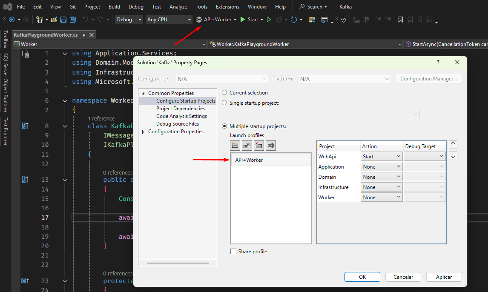
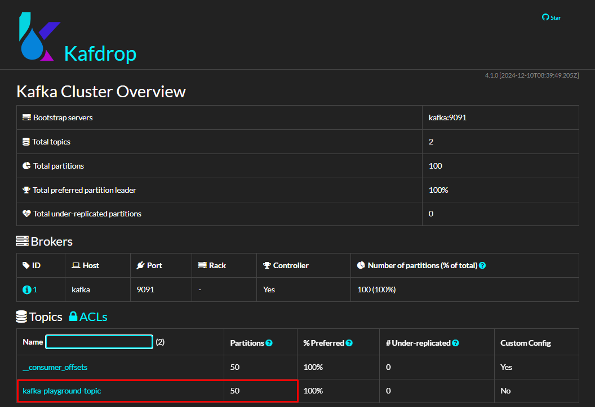
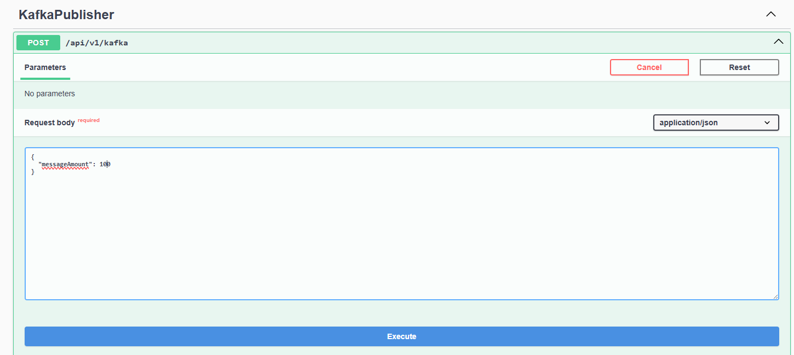
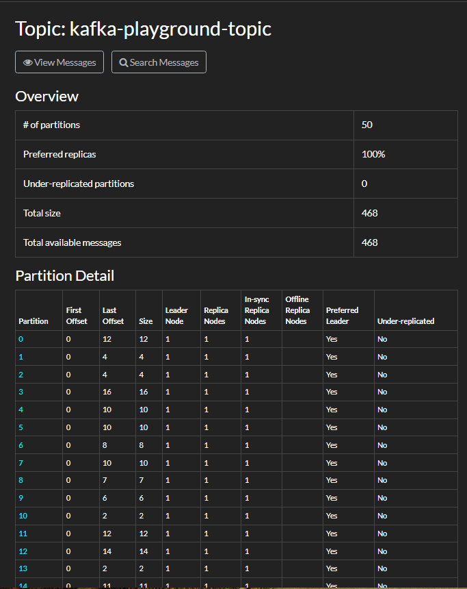
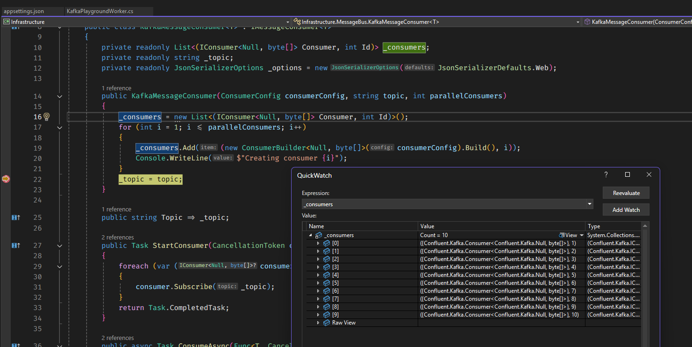
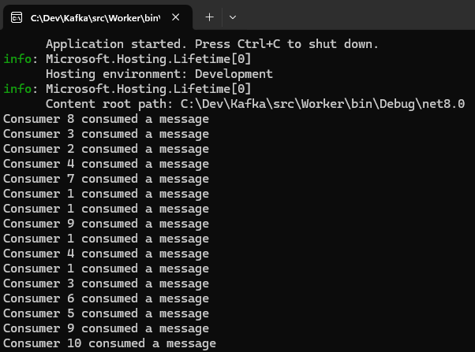

# Kafka Multiple Consumers

This project demonstrates how to create a .NET 8 Kafka consumer with multiple instances using a background service and Web API to publish messages. It scales horizontally to process high-volume data, ideal for financial calculations.

## Overview

I built this POC to explore Kafka’s scalability, configuring 10 consumers per instance. It mirrors real-world scenarios like brokerage calculations.

## How to run

Using visual studio run the API + Worker profile and it will start both projects.




Run the docker-compose file to start the Kafka and Zookeeper containers.

```bash
docker-compose up
```

## Database

The docker compose will create a SQL Server and a database, when the POST /api/v1/kafka endpoint is called, it will insert some data into SAMPLE_MESSAGES table.


## Kafka Initialization Script

The docker compose will also create a Kafka topic called "kafka-playground-topic" and the topics, partitions, messages etc can be inspected with Kafdrop:



## Healthcheck

You can also check if the docker containers are running properly by accessing the healthcheck endpoint "/health/ready".

### Healthy


### Unhealthy

If something goes wrong, you will se an error message like this one, and it will guide you through the problem.


## Web API

The Web API here has only one job, to publish messages to a kafka topic so they can be consumed by a worker.



## Inspecting Published Messages

Once the messages were published, we can inspect them using Kafdrop.



## Worker

The worker is a background service that consumes messages from the kafka topic and processes them. It is configured to have multiple consumers per instance, which allows it to scale horizontally and process messages in parallel. In this example I defined 10 consumers and we can inspect them here:



And once we publish some messages via Web API the worker will consume them, in this case I logged messages to verify parallel processing:



So we can see the it is randomly choosing the consumers to process the messages, and it is also processing them in parallel.

## Real World Example

In a real world example, you would have a Kafka cluster running in a cloud provider, and you would use a library like Confluent.Kafka to produce and consume messages.

This solution of multiple consumers could be used to run multiple instances of the same consumer, or to run different consumers that process the same messages in different ways. We could have for example a repository reading millions of lines of a database and publishing them on a kafka topic, later on our worker would read those millions of lines and calculate brokerages for example and store the calculated values in a different database. This way we could have multiple workers doing the same job, or different jobs, and scaling horizontally.

This POC effectively demonstrates scalable Kafka patterns in the consumer side.

## Known Issues

If you have any trouble running locally, I suggest these useful docker commands:

Remove all containers:
docker rm -vf $(docker ps -a -q)

Remove all Volumes:
docker volume rm $(docker volume ls -q)

Not necessary, but if you want to remove all images:
docker rmi -f $(docker images -a -q)

If the database doesn't proper initialize, try increasing the 60 seconds in the docker-compose file here:

```yaml
command: /bin/bash -c "sleep 60 && /opt/mssql-tools/bin/sqlcmd -S sqlserver -U sa -P Password123! -d master -i tmp/init.sql"
```
## Portfolio

Check my [portfolio](https://paolofullone.github.io/) to see my projects and articles.

## Portfolio

Explore more at [paolofullone.github.io](https://paolofullone.github.io/).

## Conclusion

This POC showcases scalable Kafka patterns. It is not meant to be used in production, but it can be used as a starting point for building a real world application.